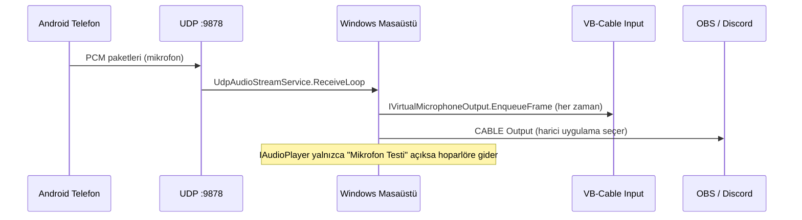

# WirelessMic — Agent Onboarding Dökümanı

Bu döküman, projeye yeni başlayan bir AI agent veya geliştiricinin mevcut durumu hızlıca anlaması için hazırlanmıştır. **Son güncelleme:** 2026-07-07.

---

## 1. Proje Özeti

**WirelessMic**, Android/iOS telefonu yerel ağ (LAN) üzerinden Windows bilgisayar için **kablosuz mikrofon** olarak kullanan tek bir **.NET 10 MAUI** uygulamasıdır.

| Platform | Rol | Davranış |
|----------|-----|----------|
| **Windows** | Masaüstü (sunucu) | Keşif dinler, bağlantı kabul eder, UDP ses alır, **VB-Cable** üzerinden sanal mikrofon çıkışı verir |
| **Android** | Telefon (istemci) | Bilgisayarları keşfeder, bağlanır, mikrofon yakalar, UDP ile ses gönderir |
| **iOS** | Telefon (planlanan) | Şu an `NoOpMicrophoneService` — gerçek mikrofon yok |

**Kritik ürün kararı:** Alınan ses **varsayılan olarak hoparlöre gitmez**. Uygulama harici mikrofon (VB-Cable → OBS/Discord) odaklıdır. Hoparlörden dinleme yalnızca masaüstündeki **“Mikrofon Testi”** butonu ile açılır.

**GitHub:** `https://github.com/yunsemree/WirelessMic`  
**Yerel örnek yol:** `C:\Users\Emre\repo\WirelessMic`

---

## 2. Mimari (Clean Architecture)

```
WirelessMic.App            → Sunum (MAUI UI, ViewModel, platform implementasyonları)
WirelessMic.Application    → Arayüzler, DTO'lar, DI extension (use case yok, MediatR yok)
WirelessMic.Domain         → Enum'lar, AppSettings modeli
WirelessMic.Infrastructure → UDP keşif/bağlantı/ses, Serilog, ayarlar, NoOp platform servisleri
WirelessMic.Shared         → Protokol ve ses sabitleri
tests/WirelessMic.Tests    → Birim testleri (10 test)
```

### Katman kuralları (agent için zorunlu)

- Domain → dış katmana bağımlı olmamalı
- Application → yalnızca Domain + Shared
- Infrastructure → Application arayüzlerini implemente eder
- App → Application + Infrastructure + Shared; platforma özel kod `#if ANDROID/WINDOWS/IOS` ile
- Modüller arası doğrudan entity paylaşımı yok; iletişim arayüz ve DTO ile
- **Minimal diff** tercih et; mimariyi kullanıcı istemedikçe yeniden tasarlama

---

## 3. Solution ve Derleme

- Solution dosyası: `WirelessMic.slnx` (Visual Studio 2026+ formatı)
- Target framework: **net10.0**
- MAUI App TFM'leri: `net10.0-android`, `net10.0-ios`, `net10.0-maccatalyst`, `net10.0-windows10.0.19041.0`

### Windows özel csproj ayarları

```xml
<WindowsPackageType Condition="...windows...">None</WindowsPackageType>
```

- Unpackaged EXE modu; MSIX/AppxManifest gerekmez
- **`Platforms/Windows/Program.cs` OLMAMALI** — MAUI SDK kendi `Main` giriş noktasını üretir; manuel `Program.cs` “multiple entry point” hatası verir

### Derleme komutları

```powershell
# Windows
dotnet build src\WirelessMic.App\WirelessMic.App.csproj -f net10.0-windows10.0.19041.0

# Android
dotnet build src\WirelessMic.App\WirelessMic.App.csproj -f net10.0-android

# Testler
dotnet test

# Dağıtım
.\scripts\publish.ps1 -All
```

### Güvenlik duvarı

UDP portları açık olmalı: **9876** (keşif), **9877** (bağlantı), **9878** (ses).

---

## 4. Tamamlanan Özellikler (Faz Durumu)

| Faz | Durum | Detay |
|-----|--------|-------|
| 1 | ✅ | Proje kurulumu, DI, Serilog, MVVM, Shell, `appsettings.json` |
| 2 | ✅ | `IDeviceRoleService` — Windows=Desktop, Android/iOS=Phone |
| 3 | ✅ | UDP broadcast keşif (port 9876) |
| 4 | ✅ | `UdpConnectionManager` — CONNECT, heartbeat, ping/pong, reconnect |
| 5 | ✅ | Android `AudioRecord` mikrofon yakalama + foreground service |
| 6 | ✅ | UDP PCM ses akışı (`UdpAudioStreamService`) |
| 7 | ✅ | Windows VB-Cable sanal mikrofon (`IVirtualMicrophoneOutput`) |
| 8 | ✅ | Mikrofon testi hoparlör dinlemesi (`IAudioPlayer` / `WindowsAudioMonitor`) |
| — | ❌ | iOS gerçek mikrofon |
| — | ❌ | `IAudioBuffer` jitter buffer |
| — | ❌ | Opus sıkıştırma (`IAudioEncoder` / `IAudioDecoder` arayüzleri boş) |
| — | ❌ | Bağlantı kopunca ses pipeline otomatik yeniden başlatma |
| — | ❌ | Kendi sanal mikrofon sürücüsü (VB-Cable dışı) |

> **Not:** Kök `README.md` geliştirme tablosu güncel değil (Faz 5–8 hâlâ “Bekliyor” yazıyor). Bu dökümana güven.

---

## 5. Ağ Protokolleri

### 5.1 Keşif — UDP 9876

**Telefon → broadcast:**
```
DISCOVER_MIC_SERVER
```

**Masaüstü → unicast yanıt:**
```
MIC_SERVER
{ComputerName}
{IP}
{Version}
```

İlgili dosyalar:
- `src/WirelessMic.Shared/Constants/DiscoveryProtocol.cs`
- `src/WirelessMic.Infrastructure/Discovery/DiscoveryMessageFormatter.cs`
- `src/WirelessMic.Infrastructure/Discovery/UdpNetworkDiscovery.cs`

### 5.2 Bağlantı — UDP 9877

Mesajlar: `CONNECT`, `CONNECT_OK`, `CONNECT_FAIL`, `DISCONNECT`, `HEARTBEAT`, `HEARTBEAT_ACK`, `PING`, `PONG`

İlgili dosyalar:
- `src/WirelessMic.Shared/Constants/ConnectionProtocol.cs`
- `src/WirelessMic.Infrastructure/Networking/ConnectionMessageFormatter.cs`
- `src/WirelessMic.Infrastructure/Networking/UdpConnectionManager.cs`
- `src/WirelessMic.Infrastructure/Networking/LatencyMonitor.cs`

### 5.3 Ses — UDP 9878

PCM paket formatı (big-endian header):

| Alan | Boyut | Açıklama |
|------|-------|----------|
| Sequence | 4 byte | Sıra numarası |
| Timestamp | 8 byte | UTC ticks |
| Length | 2 byte | Payload uzunluğu |
| Payload | N byte | Ham PCM |

Ses parametreleri (`AudioConstants`):
- 48 kHz, 16-bit, mono
- Frame: 20 ms → **1920 byte** (`FrameSizeBytes`)

İlgili dosyalar:
- `src/WirelessMic.Shared/Constants/AudioProtocol.cs`
- `src/WirelessMic.Shared/Constants/AudioConstants.cs`
- `src/WirelessMic.Infrastructure/Audio/AudioPacketSerializer.cs`
- `src/WirelessMic.Infrastructure/Audio/UdpAudioStreamService.cs`

---

## 6. Ses Pipeline Akışı



### Masaüstü başlangıç (`MainViewModel.StartDesktopServicesAsync`)

1. `_networkDiscovery.StartListeningAsync()`
2. `_connectionManager.StartServerAsync()`
3. `_virtualMicrophone.StartAsync()` — VB-Cable bulunamazsa `IsVirtualCableReady=false`
4. `_audioStreamService.StartAsync()` — UDP 9878 dinler

### Telefon bağlantı (`MainViewModel.ConnectToServerAsync`)

1. Mikrofon izni
2. `_connectionManager.ConnectAsync(ip, 9877)`
3. `_audioStreamService.StartAsync()`
4. `_microphoneService.StartCaptureAsync()`
5. `FrameCaptured` → `_audioStreamService.SubmitCapturedFrame`

---

## 7. Platform Servisleri ve DI

Kayıt sırası (`MauiProgram.cs`):
```
AddPlatformServices() → AddApplication() → AddInfrastructure()
```

### `PlatformServiceRegistration.cs`

| Arayüz | ANDROID | WINDOWS | iOS / diğer |
|--------|---------|---------|-------------|
| `IPermissionService` | `MauiPermissionService` | `DesktopPermissionService` | `MauiPermissionService` / `DesktopPermissionService` |
| `IMicrophoneService` | `Droid.Services.AndroidMicrophoneService` | `NoOpMicrophoneService` | `NoOpMicrophoneService` |
| `IVirtualMicrophoneOutput` | `NoOpVirtualMicrophoneOutput` | `WindowsVirtualMicrophoneOutput` | `NoOpVirtualMicrophoneOutput` |
| `IAudioPlayer` | `NoOpAudioPlayer` | `WindowsAudioMonitor` | `NoOpAudioPlayer` |

### Infrastructure (`ServiceCollectionExtensions`)

- `IDeviceRoleService` → `DeviceRoleService`
- `ISettingsService` → `SettingsService`
- `INetworkDiscovery` → `UdpNetworkDiscovery`
- `ILatencyMonitor` → `LatencyMonitor`
- `IConnectionManager` → `UdpConnectionManager`
- `IAudioStreamService` → `UdpAudioStreamService`

### Henüz implemente edilmemiş arayüzler

- `IAudioBuffer`, `IAudioEncoder`, `IAudioDecoder`, `INavigationService` — tanımlı, kullanılmıyor

---

## 8. Önemli Dosya Haritası

### App katmanı

| Dosya | Görev |
|-------|-------|
| `MauiProgram.cs` | DI, Serilog, `appsettings.json` embedded config |
| `PlatformServiceRegistration.cs` | Platform `#if` DI |
| `ViewModels/MainViewModel.cs` | Tüm UI akışı, keşif/bağlan/test |
| `MainPage.xaml` | Tek sayfa UI (desktop + phone bölümleri) |
| `Services/MauiAppPaths.cs` | `IAppPaths` — ayar/log dizinleri |
| `Services/MauiPermissionService.cs` | Android/iOS mikrofon izni |
| `Droid/Services/AndroidMicrophoneService.cs` | `AudioRecord` yakalama |
| `Droid/Services/MicrophoneForegroundService.cs` | Arka plan bildirimi |
| `Platforms/Windows/Services/WindowsVirtualMicrophoneOutput.cs` | NAudio → VB-Cable Input |
| `Platforms/Windows/Services/WindowsAudioMonitor.cs` | NAudio → varsayılan hoparlör (test) |
| `appsettings.json` | Port ve ses ayarları (embedded resource) |
| `WirelessMic.App.csproj` | MAUI + `WindowsPackageType=None` |

### VB-Cable kullanımı (Windows)

1. [VB-Audio Virtual Cable](https://vb-audio.com/Cable/) kurulu olmalı
2. Uygulama otomatik **CABLE Input** cihazını bulur (`AudioOutputConstants`)
3. OBS/Discord'da mikrofon: **CABLE Output (VB-Audio Virtual Cable)**
4. Test için UI'da **Mikrofon Testi** (yalnızca bağlı istemci varken aktif)

---

## 9. Yapılandırma

### `appsettings.json` (App embedded)

```json
{
  "Discovery": { "Port": 9876, "TimeoutMs": 3000, "RetryCount": 3 },
  "Connection": { "Port": 9877, "HeartbeatIntervalMs": 5000, ... },
  "Audio": { "SampleRate": 48000, "StreamPort": 9878, ... }
}
```

`AppConfiguration` DTO: `src/WirelessMic.Application/DTO/AppConfiguration.cs`

### Kullanıcı ayarları (`AppSettings` — JSON dosyası)

`ISettingsService` → `{AppData}/settings.json`

Alanlar: `Theme`, `AudioQualityBitrateKbps`, `BufferSizeMs`, `AutoReconnect`, `AutoDiscovery`, `UseCompression`

---

## 10. Bilinen Sorunlar ve Uygulanan Düzeltmeler

### 10.1 Git geçmişi

- İlk commit'te `WirelessMic.App` **hiç yoktu**; solution referans veriyordu → PR #1 ile eklendi, master'a merge edildi
- Windows build fix commit: `b567a72` — `Program.cs` silindi, `WindowsPackageType=None`

### 10.2 Android namespace çakışması (KRİTİK — local fix, commit edilmemiş olabilir)

**Hata:**
```
The type or namespace name 'App' does not exist in the namespace 'WirelessMic.App.Platforms.Android'
```

**Sebep:** `namespace WirelessMic.App.Platforms.Android.Services` içinde `using Android.App` veya `Android.App.Application` yazıldığında derleyici `Android`'i kendi namespace segmenti sanır.

**Çözüm (uygulanmış, master'da commit bekliyor olabilir):**
- Servis namespace'i → `WirelessMic.App.Droid.Services`
- `Android.App.Application.Context` → `global::Android.App.Application.Context`
- `Resource.Mipmap.appicon` → `global::WirelessMic.App.Resource.Mipmap.appicon`
- `PlatformServiceRegistration`: `Droid.Services.AndroidMicrophoneService`

**Agent kuralı:** Android platform kodu için namespace path'inde `.Android.` segmenti kullanma; `Droid` kullan veya `global::Android.*` yaz.

### 10.3 README güncel değil

Faz tablosu ve bazı açıklamalar eski. Bu dökümanı referans al.

---

## 11. UI Davranışı (`MainViewModel`)

### Masaüstü

- Otomatik servis başlatma (`InitializeAsync`)
- VB-Cable durumu: `IsVbCableReady`, `VirtualMicrophoneHint`
- **Mikrofon Testi** toggle: `ToggleMicrophoneTestCommand` — `ConnectedClientCount > 0` gerekir
- Bağlantı kesilince test otomatik kapanır

### Telefon

- `DiscoverServersCommand` — UDP broadcast keşif
- `ConnectToServerCommand` — seçili sunucuya bağlan
- `DisconnectCommand`
- `AutoDiscovery` ayarı açıksa uygulama açılışında otomatik keşif

---

## 12. Testler

```
tests/WirelessMic.Tests/
  DeviceRoleServiceTests.cs
  DiscoveryMessageFormatterTests.cs
  ConnectionMessageFormatterTests.cs
```

10 test — protokol formatlama ve rol tespiti. Ses/mikrofon entegrasyon testi yok.

---

## 13. Agent İçin Çalışma Kuralları

1. **Türkçe** yanıt ver (kullanıcı tercihi)
2. **master** üzerinde çalış; kullanıcı özellikle istemedikçe PR açma
3. Commit atmadan önce kullanıcıya sor (son mesajlarda “commit atma pr açma” istendi)
4. Windows hoparlöre otomatik ses verme — ürün kararına aykırı
5. VB-Cable entegrasyonu `IVirtualMicrophoneOutput` üzerinden; hoparlör yalnızca `IAudioPlayer` test modu
6. Yeni platform kodu eklerken Android `Android.*` namespace çakışmasına dikkat
7. `Infrastructure` içinde MAUI/NAudio referansı ekleme — Windows ses kodu `WirelessMic.App` içinde kalmalı
8. Public contract'ları sessizce breaking change yapma

---

## 14. Sıradaki Mantıklı İşler (Roadmap)

Öncelik sırasına göre öneri:

1. Android namespace fix'ini master'a commit et
2. `README.md` faz tablosunu güncelle
3. iOS `IMicrophoneService` implementasyonu
4. `IAudioBuffer` jitter buffer (gecikme/ titreşim için)
5. Opus sıkıştırma (bant genişliği)
6. Yeniden bağlanınca ses pipeline otomatik restart
7. `INavigationService` kullanımı veya kaldırılması (şu an dead code)

---

## 15. Hızlı Debug Kontrol Listesi

| Sorun | Kontrol |
|-------|---------|
| Telefon bilgisayarı bulamıyor | Aynı Wi-Fi, UDP 9876 firewall, masaüstü uygulaması açık |
| Bağlanıyor ama ses yok | UDP 9878, Android izin, Windows VB-Cable kurulu mu |
| OBS'te mikrofon yok | OBS'te **CABLE Output** seçili mi (Input değil) |
| Windows derleme hatası | `WindowsPackageType=None`, `Program.cs` yok |
| Android derleme hatası | `Droid.Services` namespace, `global::Android.*` |
| Hoparlörden sürekli ses | `IAudioPlayer` test modu kapalı mı, `UdpAudioStreamService` yalnızca monitor açıkken `EnqueueFrame` çağırmalı |

---

## 16. Bağımlılıklar (Özet)

| Paket | Katman |
|-------|--------|
| Microsoft.Maui.Controls 10.0.20 | App |
| CommunityToolkit.Mvvm 8.4.2 | Application, App |
| NAudio 2.2.1 | App (Windows only) |
| Serilog + File/Debug sinks | Infrastructure |
| Microsoft.Extensions.* 10.0.9 | App, Infrastructure |

---

*Bu dosya yeni agent oturumlarında ilk okunacak bağlam dosyasıdır. Kod değiştikçe güncellenmelidir.*
